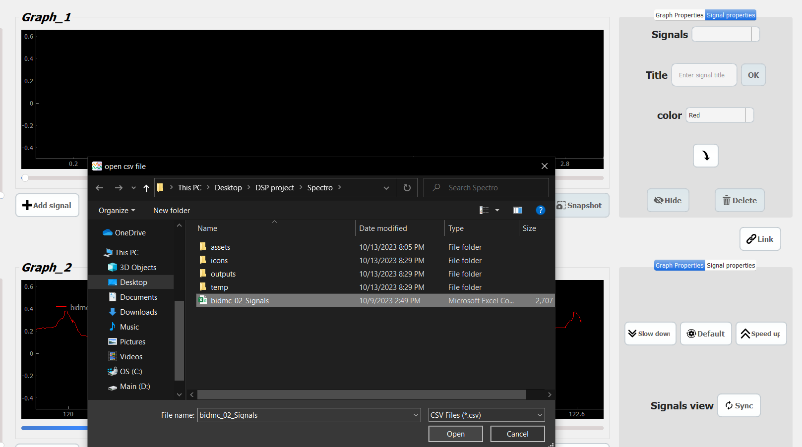

# Spectro: Multi-Channel Signal Viewer

## Introduction

Monitoring vital signals is crucial in any ICU setting. "Spectro" is a desktop application developed using Python and Qt that provides a multi-port, multi-channel signal viewer for medical signals, such as ECG, EMG, EEG, and more. This application offers a user-friendly interface to visualize and manipulate these signals.

## Features

### Signal File Management

- **Opening Signal Files:**
  
  In this screenshot, you can see how to browse your PC to open different signal files for analysis.

### Dual Graphs

- **Dual Graphs:**
  
  The application offers two identical graphs, each with independent controls. You can open different signals in each graph or link them for synchronized viewing.

### Cine Mode

- **Cine Mode:**
  
  "**Spectro**" displays signals in a cine mode, mimicking ICU monitors, allowing you to visualize signals in real-time.

### Signal Manipulation

- **Signal Manipulation:**
  
  You can manipulate signals using a range of user-friendly controls, including changing colors, adding labels, adjusting cine speed, zooming, pausing, and more.

### Exporting & Reporting

- **Exporting & Reporting:**
  
  The application allows you to generate comprehensive reports with data statistics for the displayed signals in a well-organized layout.

## Contributors

- [Ziyad ElFayoumy](https://github.com/Ziyad-HF)
- [Amgad Atef](https://github.com/amg-eng)
- [Mahmoud Mohamed](https://github.com/Mahmoudm007)

